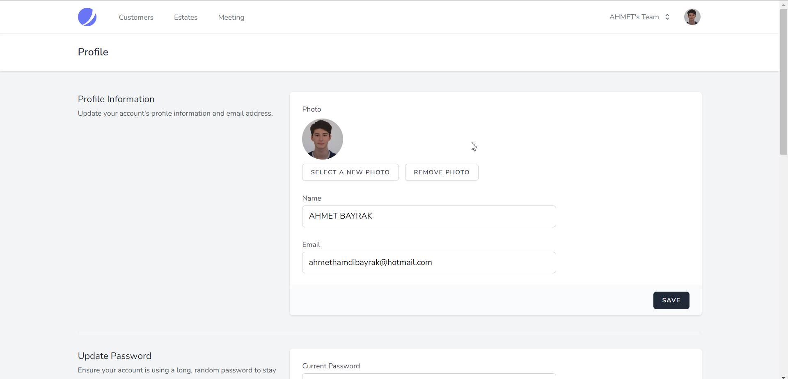

# About Real Estate Meeting Organizer
## Install
``
composer require tulparstudyo/remo
``

## Basics
This solution is a laravel based script. It was created to organize the calendar of office workers. It has four basics:

- Users 
``
They are the people who use the system. It consists of two groups.
``
- Customers 
``
Customers who want to see real estate
``
- Estates 
``
Information about real estate registered in the system
``
- Meetings 
``
Records where Users, Customers and Properties are organized together
``
## Pages Preview

